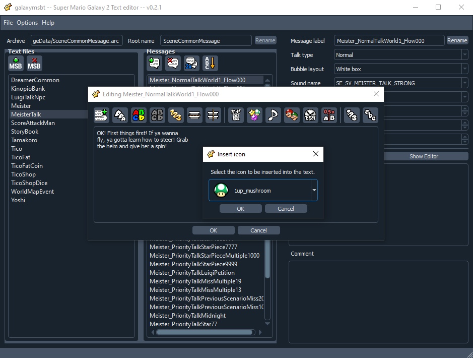

# galaxymsbt

**galaxymsbt** is a text editor that works with any MSBT file in Super Mario Galaxy 2, allowing users to edit every text-related aspect in the game. However, MSBF files are not supported yet, but support is planned for future versions. Here's a full outline of core features:

- *Every* MSBT-related aspect that is supported by the game can be edited, including attributes and tags.
- Nice and clean UI to help with text editing. You won't have to remember tags by hard anymore.
- Create new or edit existing RARC archives that contain MSBT files.
- Create as many MSBT files inside RARCs as you desire.

## Building
Even though there are prebuilt executables that you can download, you can still build the tool yourself if desired. However, there's a few steps that you have to take:

1. Clone the repository to your system.
2. Create a virtual environment for Python 3.10, preferably inside the repository's folder.
3. Install the requirements from ``requirements.txt``.
4. Install ``pyinstaller`` in your system's Python environment, **not the virtual environment** you created earlier!
5. Open the terminal in your repository and activate the virtual environment.
6. Enter ``pyinstaller galaxymsbt.spec`` in the terminal and run it.

For Windows, I prepared a Powershell script which starts pyinstaller when executed. Since I don't have a Linux system, you will have to look up a couple things yourself.

## Libraries
The tool is powered by these libraries that perform all the heavy lifting:
- [PyQt5](https://pypi.org/project/PyQt5/)
- [QDarkStyle](https://pypi.org/project/QDarkStyle/)
- [pymsb](https://github.com/SunakazeKun/pymsb)
- [pyjkernel](https://github.com/SunakazeKun/pyjkernel)
- [natsort](https://pypi.org/project/natsort/)

## Bug Reports
Please use the Issues tab to report any issues regarding the program. Alternatively, you can contact me on the [Luma's Workshop Discord server](https://discord.gg/k7ZKzSDsVq).
